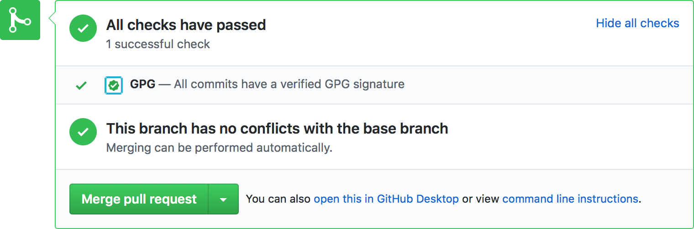
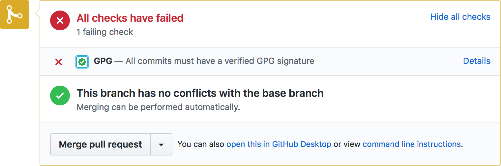

<p align="center">
  
</p>

<h1 align="center">Probot GPG</h1>

<p align="center">
  
</p>

> A GitHub App built with [Probot](https://github.com/probot/probot) that enforces GPG signatures on pull requests

[](https://travis-ci.org/jarrodldavis/probot-gpg "Build status")
[](https://coveralls.io/github/jarrodldavis/probot-gpg "Coveralls coverage status")
[](https://www.codacy.com/app/jarrodldavis/probot-gpg "Codacy status")
[](https://www.codacy.com/app/jarrodldavis/probot-gpg "Codacy coverage status")
[](https://nodesecurity.io/orgs/jarrodldavis/projects/d841ad74-0b11-47f3-9216-bc6e48414bac "NSP status")
[](https://greenkeeper.io/ "Greenkeeper status")
[](https://www.npmjs.com/package/@jarrodldavis/probot-gpg "npm")

## Setup

```
# Install dependencies
npm install

# Run the bot
npm start
```

## Usage

[Configure this app](https://github.com/apps/gpg) on your organizations and repositories. Be sure to enable [required status checks](https://help.github.com/articles/about-required-status-checks/) if you want to enforce GPG signatures on all pull requests.

See [docs/deploy.md](docs/deploy.md) if you would like to run your own instance of this plugin.

## How it works

Git supports [signing commits with GPG keys](https://git-scm.com/book/en/v2/Git-Tools-Signing-Your-Work) to verify commit authorship beyond the easy-to-forge [author](https://git-scm.com/docs/git-commit#git-commit---authorltauthorgt) field.

GitHub supports [verifying GPG signatures on commits](https://github.com/blog/2144-gpg-signature-verification) and has an excellent [series of help articles](https://help.github.com/articles/signing-commits-with-gpg/) for creating a GPG key, using it with `git` locally, and linking it to a GitHub account.

After installation, this app [checks all commits](https://developer.github.com/v3/repos/commits/#compare-two-commits) of new (or newly updated) pull requests for valid GPG signatures [according to the GitHub API](https://developer.github.com/changes/2016-04-04-git-signing-api-preview/). Note that for the status check to be `success`, _every_ contributor of a pull request must:
- set up a GPG key on their local machine
- sign _all_ of their commits in the pull request with that key
- link that key with their GitHub account



Otherwise, the app will set the status to `failure`.



## Email privacy

If you or any of your contributors use a [GitHub-provided `noreply` email address](https://help.github.com/articles/about-commit-email-addresses/) to keep a personal email address private, that `noreply` address should be used when creating a GPG key. Make sure that [`git`'s config is also using that `noreply` address](https://help.github.com/articles/setting-your-commit-email-address-in-git/) so that GitHub associates the GPG key correctly and validates it.

## Further reading

- [Git Tools - Signing Your Work](https://git-scm.com/book/en/v2/Git-Tools-Signing-Your-Work)
- [GitHub Help: Signing commits with GPG](https://help.github.com/articles/signing-commits-with-gpg/)
- [GitHub Help: Troubleshooting GPG](https://help.github.com/articles/troubleshooting-gpg/)
- [GitHub Blog: GPG signature verification](https://github.com/blog/2144-gpg-signature-verification)
- [GitHub Developer: Preview support for Git signing](https://developer.github.com/changes/2016-04-04-git-signing-api-preview/)
- [The GNU Privacy Guard](https://gnupg.org)
- [Setting up Git commit signing on macOS](https://gist.github.com/bmhatfield/cc21ec0a3a2df963bffa3c1f884b676b)

## Special thanks and attributions

- [@JasonEtco](https://github.com/jasonetco) for the lovingly crafted logo
- [@probot](https://github.com/probot) for the Probot head, which was found on [wikimedia.org](https://commons.wikimedia.org/wiki/File:Robot-clip-art-book-covers-feJCV3-clipart.png) and is from clipartkid.com, licensed [CC BY-SA 4.0](https://creativecommons.org/licenses/by-sa/4.0/deed.en)
